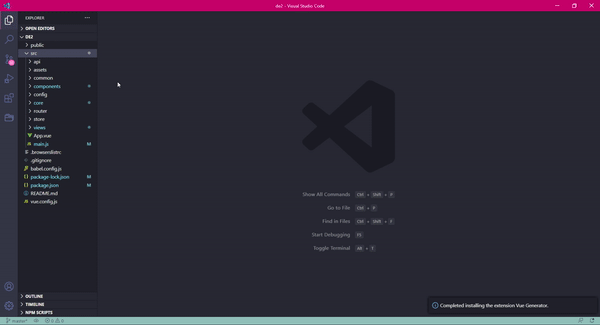

# Vue Generator

A small extension that help you to create component's boilerplate.

## How to use?

1. Right click on Explorer Window and click `Vue Generator`.

2. Enter component's name.

3. Done!

## Feature

- **Create component's boilerplate** : Right click on Explorer Window and click `Vue Generator`, then enter component's name to create boilerplate.

## Installation

Open VSCode Editor and Press `ctrl+P`, type `ext install vue-generator`.

## LICENCE

This extension is licensed under the [MIT LICENCE](./LICENCE)
